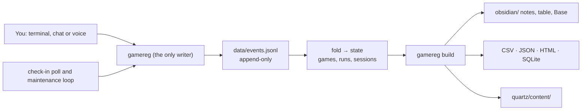

# How the Registrar works

One page on the shape of the system: what is recorded, what is derived, and why
the pieces are separated the way they are. The normative account is in
[docs/spec/](../README.md#specification), starting with
[00-architecture](../spec/00-architecture.md).

## One log, many shapes

Everything you record is appended to `data/events.jsonl`, one JSON event per
line, and nothing ever rewrites a line. Every other file — Markdown notes, the
consolidated table, CSV, JSON, HTML, the SQLite database, the site's content —
is derived from that log and can be deleted and rebuilt without loss.

Why an append-only log rather than files you edit: a model editing a structured
file in place corrupts data silently, and appending is the one operation that
cannot damage history
([D1](../spec/00-architecture.md#d1--the-source-of-truth-is-an-append-only-event-log)).
Corrections are new events, which is why `amend` and `revoke` never remove
anything.

The cost, accepted deliberately, is that state is rebuilt by folding the log on
every read. At a few thousand events that is instant.

## Game, run, session

A **game** is the title. A **run** is one playthrough of it, with an outcome, a
rating and a verdict. A **session** is one sitting inside a run, with breaks
deducted.

The middle level earns its place on replays: finishing a game again years later
is a second run, not a rewrite of the first
([D6](../spec/00-architecture.md#d6--hierarchy-game--run--session)). A run's
platform stays on the run
([ADR 0006](../decisions/0006-platform-lives-on-the-run.md)), and a game with no
runs is outside the model: the register holds what you played, not what you own
([ADR 0007](../decisions/0007-no-backlog.md)).

Durations are computed from the events, never estimated (invariant 7). Hours
you merely state — from `import`, or `--hours` — belong to the run and to no
particular day, which is why an imported year shows no days in the heatmap
([ADR 0048](../decisions/0048-year-hours-are-measured.md)).

A session belongs to a **logical day**, which flips at `day_cutoff` rather than
midnight, so a session that starts at 02:00 counts toward the evening before.
The day is derived on every fold, so travelling changes nothing retroactively
([ADR 0025](../decisions/0025-no-timezone-detection.md)).

## The build is a registry of targets

`gamereg build` folds the log once and hands that state to each target the
vault declares. A target is a pure function from state to files: it reads no
filesystem, performs no network I/O, and never reads its own or another
target's output (invariant 8). That is what makes the build idempotent — a
second run produces byte-identical output — and what let formats multiply
without the emitters knowing about each other
([D8](../spec/00-architecture.md#d8--the-build-is-a-registry-of-targets)).

Each planned file has a write policy:

| Policy | Meaning | Used by |
|---|---|---|
| `splice` | Only the text between `<!-- gamereg:… -->` markers is rewritten; your prose around it survives | Game notes, the consolidated table, the stats and review pages |
| `replace` | The file is generated whole | Run notes, CSV, JSON, HTML, SQLite, heatmap images, site content |
| `seed` | Written once, then yours | `Game Database.base`, `quartz.config.yaml` |

So there is exactly one place your own writing is safe, and it is deliberate:
run notes are data, game notes are yours
([ADR 0001](../decisions/0001-run-notes-written-whole.md)).

Deletion is the only destructive thing the build does, and it removes only what
its own manifest says a target owns and no longer plans — never by pattern,
never a seeded file ([ADR 0030](../decisions/0030-deletion-is-one-manifest-whitelist.md)).

## Offline by construction

No command that records anything touches the network. Metadata and cover art
come from a separate step, `enrich`, and `search` is the only other command
that reaches a provider — it writes nothing (invariant 5). A provider being
slow or down can never block you from recording a session, and a register whose
games exist in no catalog at all still works.

When a title is ambiguous, the CLI **returns** the candidates with exit code 3
rather than opening a prompt. The interactive menu is a presenter over exactly
that list, so a human at a terminal and an agent behind a pipe travel the same
code path ([D3](../spec/00-architecture.md#d3--the-cli-never-blocks-on-input)).

## The agent is just another caller

The chat agent translates a message into a `gamereg` invocation. It writes no
file, computes no duration and invents no identifier; the CLI validates
everything it is handed. That is why the register stays correct even when the
model is wrong — and why the interesting design questions in the agent layer
are about the prompt and the channel rather than about the data. See
[the agent layer](agent-design.md).

The same applies to the check-in poll and the maintenance loop: both are
ordinary callers of the CLI, run on a timer, holding no state of their own.

## Localized interface, English schema

Event payloads, config keys and the SQL schema are English. What you read and
type is localized: command names, prompts and generated labels come from
`i18n/<locale>.json`, so `gamereg start` and `gamereg iniciar` are the same
command ([D7](../spec/00-architecture.md#d7--english-schema-localized-interface)).
The agent never receives localized prose; it asks the CLI for the words
([ADR 0019](../decisions/0019-agent-gets-words-not-sentences.md)).

## Two repositories

This repository is the tool. Your register is a directory of your own, most
likely a private git repository: notes are personal, and keeping both in one
place would mean either publishing your diary or never publishing the code.
Git is the sync story — there is no server and no account.
