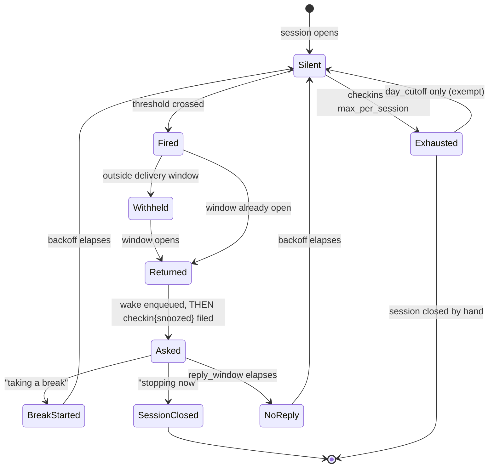

# 05 — Agent Layer

Optional. Everything below sits on top of a CLI that works without it.

## Boundary

The agent may invoke **no command but `gamereg`**. It does not read or write
vault files directly, does not edit Markdown, does not compute durations, and
does not invent identifiers. Beyond executing that one binary, a deployment
grants it only what holding a conversation needs: sending a message, for
candidate menus and covers, and reading the reference files of its own prompt.

Its actual jobs:

1. Turn a message (or a transcript) into a CLI invocation
2. Present code 3 candidates and relay the choice back
3. Relay prose — session notes verbatim, and the consolidated verdict, which it
   may draft when asked to
4. Answer questions by writing SQL for `gamereg query`

That is the whole contract. Every number in every answer comes from the database.

### How many commands a turn takes

**One or two.** This is a property of the CLI's design, not a budget imposed on
the model: a recording command's own result already carries what the agent
would otherwise have gone looking for. `start` reports `also_open`, the game's
record, and `not_found` in one call; `open` and `status` carry the event ids
`amend` and `revoke` take; a command that returned `ok: true` has already said
what happened.

Three rules follow, and they are the same rule seen from three sides:

- **Nothing is looked up before a recording command.** Not an open session, not
  the game's history.
- **Nothing is looked up to confirm one afterwards.** The result is the answer.
- **A fourth call in one turn means the agent is investigating rather than
  working**, and should say what it found instead of looking for more.

The cost of getting this wrong is not only latency. The impulse to check
something first is what produces an invented, chained invocation
(`gamereg query --sql "..." 2>&1 || gamereg --help`), and a compound shell
string is a different, unlisted command that the exec allowlist denies. It is
also what turns one contradiction into a cascade. **When the facts a turn
started from have moved on, the agent says so and asks**, rather than
investigating — see
[0072](../decisions/0072-agent-turn-command-budget.md).

## Gateway

OpenClaw is the reference deployment: self-hosted, multi-channel, handles voice
and images, has cron built in. Telegram is the recommended first channel — the
official Bot API is the least fragile.

Any gateway that can shell out works. Nothing in this spec depends on OpenClaw.

## Language

The agent replies in whatever language the user writes or speaks. It passes
`--locale` only when the user explicitly asks for output in another language:
the locale sets the CLI's output language, not the language of the conversation.

**The agent's prompt is written in English and states rules, not phrasings** — a
rule about approximate times holds for "around eight" and "umas 20h" alike, and
a model that reads the rule needs no example in either language. The utterances
quoted throughout this document are illustrations of a *mapping*, message to
invocation, and not a claim that the user speaks English. One skill, one spec,
no per-language copy of either.

**But the agent does need the register's words, and it cannot get them from a
result.** JSON is neutral by contract: prose in the Registrar's voice is exactly
what an agent behind a pipe never receives, and a gateway is never a TTY, so
`"Filed: Hollow Knight — session opened at 20:14."` is emitted for a human and
for nobody else. Every word the user reads in a chat is therefore a word the
model chose. Two things follow:

- A result carries raw tokens — `"difficulty": "hard"`, `"criteria":
  "true_ending"`, `"form": "physical"`. Narrating those in another language is
  a translation the model performs with no table, differently on different days.
- The register's own acts — *filed*, *approved*, *archived* — appear in no
  result at all. With nothing to go on, a model narrating in Portuguese reaches
  for the English word it was given in its prompt, and "filed" lands in the
  middle of a Portuguese sentence.

`gamereg vocab` (02-cli.md) answers both, and a third that goes wrong the same
way: the register's own nouns. `run` narrated as "run" in a Portuguese sentence is
the same failure as `filed` — the word exists in `i18n/`, inside sentence
templates, where nothing can look it up. The block names the things (`entity`:
game, run, session, break, verdict) as well as what happens to them.

It reports one block — the words, for the requested locale — and never a
sentence template. That boundary is the
safety argument: a template carries `{title}`, and a model handed one can fill
it in and produce something indistinguishable from output the CLI actually
emitted. A word cannot be filled in.

So: **the vocabulary is data the CLI serves, never a glossary the agent layer
keeps**
([0019](../decisions/0019-agent-gets-words-not-sentences.md)). `i18n/<locale>.json` stays the one place each term is written down. A
copy under `agent/` could disagree with it silently; a `reference/locale/*.md`
per language, or a skill per language, multiplies every behaviour rule by the
number of locales with one anti-drift test able to check one of them.

## A run is not a session

Conflating the two is the most likely narration error the agent makes, because
the nesting is invisible in a single JSON result. A **run** is a playthrough and
stays open for weeks; a **session** is one sitting and is usually not open at
all. `status` reports `open_runs` and says nothing about sessions, so an agent
answering a question about sessions from `status` is answering from the nearest
field rather than the right one. `gamereg open` is the command for that, and an
open run with no open session is this register's ordinary resting state.

## Voice

Transcription happens **before** the CLI sees anything. `gamereg` never touches
audio: the gateway transcribes and hands over text. The reference deployment
uses the gateway's own audio tool, with a hosted model in the shipped
configuration and a local Whisper as the alternative when the audio should not
leave the machine.

Transcribed titles are unreliable. This is precisely why resolution has an alias
table (see 03): the user corrects a mis-transcribed title once.

## Flows

### Starting

> "starting hollow knight"

**The agent corrects how a title was written; it never decides which game was
meant.** Fixing spelling, casing and punctuation is transcription work — "some
pacman on the atari" becomes `gamereg start "Pac-Man" --platform Atari` — and
being slightly off there is cheap: `enrich` corrects the stored title and files
the guess as an alias (01-model.md).

Completing a title is a different act. "Super Mario" is not a misspelling of a
particular Mario game; it names a family, and choosing a member of it is a
decision the user did not delegate. When the words given match more than one real
game, that is a question, asked with `gamereg search` **using the user's own
words** and answered with `--id`. A search narrowed by the agent's own guess
returns a list already shaped by an assumption the user never made.

This is not a matter of taste, because guessing here is not cheap the way a
spelling guess is. `start` performs no network I/O, so an unrecognised title
returns `not_found` whether or not the catalog knows it; taking that as licence
to create writes a game record under an invented name. And once a local record
exists, `gamereg search` stops consulting the provider — it asks the catalog
only when nothing local matches — so the invented title answers every future
search and keeps confirming itself.

For a title that may not be on record, the deployed procedure leads with
`gamereg search "hollow knight" --json`, which answers both questions at once —
what the register holds and what the catalog has — and exits 0 either way. Then
`gamereg start --id <ref>`. For a title already on record, `gamereg start
"hollow knight" --json` is one call, and a code 3 is presented as candidates and
re-invoked with `--id`.

**Do not ask for the platform here.** `start` no longer needs one (02-cli.md),
and asking is the wrong move twice over: the user announced they were *playing*,
not that they wanted an interview, and the agent usually has no catalog to
offer a sensible list from yet. Start the session, and let the platform arrive
when the session closes.

When the user volunteers it — "hollow knight on the switch" — pass it as
`--platform switch` and say nothing further about it. When they do not, the
result comes back with `"platform": null` and `platform_source` absent, which is
not an error condition to report.

### Switching games

A second session opened while one is running is almost always a switch, not two
games at once. The register does not decide that: `start` never closes anything,
and someone genuinely playing two things in an evening is doing nothing wrong.

So the result says what is open — `also_open`, with the ids (02-cli.md) — and
the agent *offers*. It opens what was asked for first, since the switch is its
inference and not the user's instruction, then offers to close the other in the
same reply. With two sessions open, the close must name its game or it comes
back as a code 3 asking which.

The close is stamped now, when they said they were moving on, unless they say
otherwise. An agent that back-dates it on its own is inventing a time, which is
the one thing it must never do with a clock.

### Ending

> "just stopped, played well, got to the Watcher Knights" *(voice)*

`gamereg end --note "<transcript, lightly cleaned>" --json`

The note is the user's words. Summarizing at this stage destroys the raw material
the verdict is built from later. Fix obvious transcription errors; keep voice,
slang and profanity.

**This is where the platform question belongs, and only when it is still open.**
`end`, `finish` and `drop` return `"platform": null` when nobody has answered
yet and the CLI could not settle it on its own. That is the cue — and the only
cue — to ask. A result that comes back with a platform was either told, inherited
or resolved; asking anyway is asking a question the register already answered.

What to offer is not the agent's invention. `gamereg platform list --json`
reports the register's own configured platforms, and the game's `platforms`
field reports what the catalog knows; between them they carry the same
information the CLI menu groups
(02-cli.md, *What gets offered, and when nothing is asked*): the ones the user
owns that the game exists on, then the rest of the catalog, then the rest of
what they own, then free text. Order matters more than length here — "PS5 or Switch?" is a good question, a list of fourteen platforms is a form.

Answer it with a follow-up `--platform`, or with `gamereg amend` when the run
has already closed. Never invent a platform to avoid asking, and never treat a
`platform_source: "intersection"` result as needing confirmation unless the user
gives a reason to doubt it — mention it in passing ("noted it on the PS5"), which is
enough for them to correct it if the console was someone else's.

**A platform mentioned in passing is an early answer to that same question, not
a new conversation.** People say where they are playing without being asked. The
agent holds the mention and passes it as `--platform` at the close, the way it
holds a photo that arrives mid-session, and says nothing while doing so: the
close reports what was recorded, which is where the user sees it landed. The
flag fills a `null` platform and corrects a wrong one alike (02-cli.md), so
neither case needs `amend` or a confirmation.

Forgetting costs one redundant question at the close and nothing else, which is
the point — the mention is worth capturing, never worth interrupting for. The
agent offers explicitly only when no close is coming to carry the flag: a run
already closed, or a mention that contradicts a platform recorded on a run the
user is not about to close. Both are corrections, and corrections are stated and
confirmed before they run.

### A session opened by mistake

Nothing is deleted: `revoke` appends an event saying an earlier one does not
count (01-model.md, *Corrections*). The agent's job is to get the extent and the
order right, and the extent is not something it has to work out — the command
that made the mess returned `events[]`, which is exactly what it wrote. `start`
also returns `created` and `run_opened`, so the shape is legible: a game not on
record produces three events, a game on record with no open run two, a game
whose run is already open just one.

**Revoked in reverse order, last written first.** Revoking a `game.create`
while its `run.open` still stands leaves events referencing a game that no
longer folds; `doctor` reports an orphan reference for each and exits 1. Going
backwards, every intermediate state is one the register already understands — a
run with no sessions is what `past` files — so an interrupted correction is a
consistent register, not a corrupt one.

**A `game.create` is only ever revoked by the command that wrote it.** For a
game already on record, that event is the root of every run, session and verdict
it has; revoking it to undo one session would take all of that with it.

This is `revoke`, so the confirmation protocol applies: state what will stop
counting, by name, and wait for an unambiguous yes.

### The wrong game, chosen from the menu

Worse than it looks, and the reason is the alias. Resolving a code 3 by `--id`
files the query as an alias on the game that was picked (03-resolution.md), so a
wrong pick does not misplace one session — it wires that word to the wrong game
for good. The next time it is asked there is no menu at all, and nothing about
the answer looks wrong. `gamereg alias` only adds; revoking that `game.alias`
event is the only way back.

The undo is the previous flow with a wider net: everything filed on that game
since the mistake, not only what the mistaken command wrote, revoked
last-written-first. A `session.close` left behind after its `session.open` is
revoked is an orphan reference like any other. **`gamereg doctor` is the check**
— it names every event still pointing at a revoked one, which is what tells the
agent whether it caught them all.

Then the command is reissued against the right candidate, and the alias is
learned onto the game the user meant: the same mechanism that caused the
problem, working as designed.

### Photos

Images arriving in chat are written to a temp path by the gateway and passed as
`--photo`. The agent never moves, renames or hashes files — ingestion is the
CLI's job (see [04-derived](04-derived.md)).

Three things the agent decides, and only these:

**Which command the photo belongs to.** A photo with no text, arriving while a
session is open, attaches to the session that is about to close — hold it and
send it with `end`. A photo arriving alone with no open session is ambiguous:
ask, do not guess. `gamereg attach` exists for exactly this.

**What kind of photo it is.** `--kind` is advisory in the model (01-model.md) —
it drives presentation, never logic — but for the agent it is the decision the
other two hang off, so it is made first and made on what the image shows. A
capture of the game running is a `screenshot`; a photograph of a boxed copy, a
manual or a shelf is `box`; a cartridge, disc or cassette is `media`.
Photographing a game is not screenshotting one, and misfiling the first as the
second is what makes both decisions below miss.

**Whether it becomes the cover.** A `box` or `media` photo is a picture of the
thing itself, which is what a cover is for. With no cover on the game yet, the
agent passes `--as-cover` and says so in one line: nothing was replaced, so
there is nothing to ask about. With a cover already there, it offers instead —
replacing the one image the user sees every time, uninvited, is annoying in a
way an extra attachment never is. A cover set this way is `source: user` and
enrichment will never overwrite it (non-negotiable 11); `cover --reset` is the
way back.

The vocabulary matters in the reply, too. A cover belongs to a **game**. There
is no cover of a session, and a photo attached to a session event is attached to
it, nothing more.

**Whether it says the run is physical.** A `box` or `media` photo arriving with
a `start` is evidence about that run: the agent passes `--form physical` in the
same invocation and mentions it in passing, exactly as an inferred platform is
always mentioned. `--form` exists only on `start` and `past`, so the same
conclusion reached later is an `amend` — offered and confirmed, never inferred.
The evidence is good and not conclusive, which is why it is stated rather than
filed in silence.

Captions come from the accompanying message, verbatim. If the message is a voice
note, the transcript is the caption.

When the CLI reports a `captured_at` from EXIF that differs from now by more than
an hour, surface it:

> *The photograph reports 22:40 yesterday. File the session as ending then?*

That turns a forgotten `end` into a one-tap correction, using metadata the user
did not know they were sending.

### Check-ins

The Registrar occasionally notices an open session and says something. A cron
job runs a wrapper on a schedule (hourly is enough), and the wrapper does four
things in this order: sweeps expired check-ins (`gamereg checkin --expire`),
asks `gamereg due --json` what is owed, wakes the agent for each row, and files
the check-in once the wake has returned. The CLI decides what is due, so cron
carries no state and no logic.

That job is a **command, not an agent turn**: it runs the binary on the gateway
host and no model is involved. Only when `due` comes back non-empty does the
wrapper wake the agent, handing over the facts it has already fetched. A poll
that finds nothing therefore costs nothing, which is what makes hourly
affordable. The wrapper still decides nothing — it relays what `due` returned and
records that it did, which is why the sentence above holds — and the decision to
speak stays inside the CLI, where invariant 7 wants it. A gateway heartbeat would
work mechanically and is the wrong shape: it asks a model to decide again what
`due` has already decided.

Empty → say nothing. This matters more than any other rule here: an assistant
that pings when it has nothing to ask gets muted within a week, and then the
`day_cutoff` chase stops working too — which is the one that actually costs data.

#### Triggers

| Trigger | Fires when | Register |
|---|---|---|
| `duration` | The session has stood open for `checkin.after` (default 4h) **with no break in the stretch** | Curious, offers a break |
| `clock` | A configured wall-clock time passes with a session open | Gently practical |
| `day_cutoff` | Session still open past `day_cutoff`, asked at `chase_at` | Formal; asks for a closing time |

#### When the day_cutoff chase is *delivered*

Two different concepts, previously conflated. Keep them as separate config keys.

| Key | Meaning | Default |
|---|---|---|
| `day_cutoff` | When the logical day flips, for grouping and reporting | `05:00` |
| `checkin.chase_at` | When the Registrar actually asks about it | `09:00` |

The trigger *fires* when a session is still open past `day_cutoff`. The question
is *delivered* at the next occurrence of `chase_at`.

Asking at 00:05 asks while the session is most likely still running — the honest
answer is "still playing", the chase achieves nothing, and it interrupts. Asking
the next morning asks about something definitively over:

> *Good morning. A session of Hollow Knight stands open, filed yesterday at
> 20:14. At what hour was it closed?*

Set `chase_at: null` to ask immediately at the cutoff instead. Someone who plays
in the afternoon may genuinely prefer that.

**Cost, accepted knowingly:** recall degrades over eight hours. "I stopped around
1am" is fuzzier than an answer given at the time. Mitigate in the phrasing — always
state the game and the opening time so there is something to anchor against.
Precision here is worth less than being asked at a moment you can actually reply.

**Still playing at `chase_at`** is a real case (an all-nighter running into
morning). It is not an error: "still going" snoozes it as always.

#### One message, not N

When several sessions are pending at `chase_at` — rare, but it happens across a
weekend — the agent sends **one** message listing them, not one per session. Each
still gets its own `checkin` event and its own answer routing.

The morning slot is also the natural place for anything else periodic later
(yesterday's total, a streak). Out of scope for now; the point is that `chase_at`
is a *delivery slot*, not a single feature.

#### When the wake's facts are already stale

The array the agent is woken with is a snapshot taken by `gamereg due` at poll
time, in a different process, against a vault the agent shares with a human who
may have used the CLI directly since. It can therefore name a session that is
no longer open, or was revoked outright.

**The agent says so in one line and stops.** It does not investigate, does not
go to `query`, and does not act on the nearest open session instead. This is a
consequence of the priority in *Boundary* above — the facts are the facts, and
a check-in is the one message sent without having run anything — extended to
its only failure mode: when the facts turn out to be false, there is nothing to
verify them *against* that would make the question answerable, so the only
correct move is to say the check-in refers to something no longer open.

The failure this prevents is a cascade: a wake naming a game with no session
anywhere in the log, answered by investigating, produced a `break start` on a
*different* game and a break that had to be revoked. See
[0072](../decisions/0072-agent-turn-command-budget.md).

#### Chasing vs noticing

`day_cutoff` is **chasing missing data** — it wants a closing time it does not
have. That is why it gets its own budget and its own delivery slot.

`duration` and `clock` are **noticing**. They have no data to collect, so they
must read as interest rather than enforcement, and they may go quiet with no
cost to the record:

> *Eight hours in on Hollow Knight. The Registrar makes no judgement, but does
> note that chairs were not designed for this. How is it going — worth a pause?*

Each check-in offers three exits, and the reply routes to a command:

| Reply | Command |
|---|---|
| "taking a break" | `gamereg break start --id game:<game_id>` |
| "stopping now" + impressions | `gamereg end --id game:<game_id> --note "..."` |
| "still going" / anything else | nothing to run; the record stays `snoozed` until the reply window passes, after which the sweep amends it to `no_reply` |

This is what finally makes breaks get used. Nobody remembers to run
`break start` on their own; being asked at hour four is exactly when it is
useful.

#### Anti-nagging rules

Non-optional. Violate these and the feature makes the whole assistant annoying.

1. The **wrapper** files `gamereg checkin --outcome snoozed`, and it does so
   only once the wake has returned successfully — never before it. The wake is
   a synchronous call, so a gateway that was down leaves the session eligible
   on the next tick instead of silently in backoff. The session is then inside
   its backoff window and will not be raised again. The agent does not file
   this and must not try to
   ([0031](../decisions/0031-wrapper-files-checkin-after-wake.md)).
2. Backoff **escalates**: `checkin.backoff` is a list, default `[2h, 3h, 5h]`,
   measured from the last check-in of any trigger. Past the end of the list the
   last step repeats; the ladder alone never stops the asking.
3. `checkin.max_per_session` (default 3) is the hard ceiling that does, and it
   counts only `duration` and `clock` — the fourth noticing check-in is the one
   that never happens.
4. Silence is an answer. After `checkin.reply_window` (default 45m) with no
   reply, `gamereg checkin --expire` amends the record to `no_reply`. The sweep
   runs at the start of every tick, before `due`, so the effective resolution is
   the poll interval rather than the window itself. Do not re-ask, do not escalate tone. Nothing here is the agent's either:
   it would have to keep a promise 45 minutes after the fact, which is not
   something a chat turn can do.
5. Never auto-close, auto-pause, or estimate a duration. A guessed number
   silently corrupts every statistic downstream.
6. `day_cutoff` has its own budget and is never suppressed by the other two —
   missing data is worth one ask even after three check-ins.

#### The whole cycle

The parts above are one machine. Read per open session, per trigger:



`Fired → Withheld` is `quiet_hours` for `duration` and `clock`, and `chase_at`
for `day_cutoff`. `day_cutoff` ignores `quiet_hours` and is exempt from both the
backoff ladder and the ceiling, which is why it can leave `Exhausted`. With
`checkin.after` set to `null` the `duration` trigger never leaves `Silent`.

**A break is the one thing that returns a trigger to `Silent`.** `duration`
measures the *stretch* of play with no break in it — from the opening, or from
the end of the last break since — so `Asked → BreakStarted` puts it back where
it started rather than leaving it fired against a wall clock nobody was playing
([ADR 0102](../decisions/0102-a-break-returns-duration-to-silent.md)). Nothing
is offered while a break is running either: the pause has already been taken.
`clock` and `day_cutoff` are not held by a break, since neither is offering one.

Three components move this machine, and the split is the whole design:

| Transition | Owner | How |
|---|---|---|
| `Silent → Fired → Withheld → Returned` | **CLI** | `gamereg due` — threshold, quiet hours, delivery window, backoff, ceiling |
| `Returned → Asked` | **cron wrapper** | run the wake, then `gamereg checkin --outcome snoozed` once it has returned |
| the wording of the question | **agent** | prose only; the facts come from `due` |
| `Asked → BreakStarted` / `SessionClosed` | **agent** | `break start` or `end --note`, then amend the outcome |
| `Asked → NoReply` | **cron wrapper** | `gamereg checkin --expire`, on the first tick after the reply window passes |

The agent owns one row and half of another. Everything with a clock or a counter
in it belongs to the CLI, per invariant 7, and everything that has to survive
between two conversations belongs to the wrapper, because a chat turn cannot
remember a deadline.

The amend in the fourth row needs an id the agent was never handed — the wake is
enqueued before the check-in is filed, so the record does not exist yet when the
question arrives. It comes off `gamereg open`'s `last_checkin_id`, read while the
session is still open. See [02-cli](02-cli.md).

#### Personality

The Registrar can be dry, theatrical or barely there. Its voice comes from the
deployment's own prompt files — in the reference deployment,
`agent/workspace/SOUL.md` and `IDENTITY.md` — and not from the register's
configuration, which holds only the clock and the counters:

```json
{
  "day_cutoff": "05:00",
  "checkin": {
    "after": "4h",
    "clock": ["01:00"],
    "chase_at": "09:00",
    "backoff": ["2h", "3h", "5h"],
    "max_per_session": 3,
    "reply_window": "45m",
    "quiet_hours": ["02:00", "09:00"]
  }
}
```

There is no persona setting in `gamereg.config.json`: a vault that still carries
the old `checkin.persona_prompt` key exits 2 at load, naming it as unknown.

`quiet_hours` suppresses `duration` and `clock` only. A trigger that fires inside
the window is not lost — it is held and delivered at the end of it, merged into
the morning message. `day_cutoff` ignores `quiet_hours`, since `chase_at` already
places it outside them.

Phrasing is generated per message — a fixed string read for the tenth time stops
being funny and starts being a notification. The trigger, the elapsed time and
the game are given as facts; the wording is the model's.

Two constraints on any persona, whatever the pre-prompt says:

- It **offers**, never judges. "Not good to take a break?" is an invitation;
  "you've been playing too long" is a different product and a worse one.
- It can be turned off. `checkin.after: null` disables the `duration` trigger;
  a genuinely silent ledger also needs `clock: []`, since that trigger is
  independent. The `day_cutoff` chase survives both, which is the point: the
  one check-in that chases missing data stays.

### Finishing

> "done, loved it, 9 out of 10, hard, got the true ending"

Two steps, in order:

1. `gamereg finish "..." --rating 9 --difficulty hard --criteria true_ending`
2. The verdict, whenever the words arrive, via `gamereg verdict`

**The verdict is not the agent's to write uninvited.** `gamereg verdict` takes
prose from anywhere — typed at a terminal, dictated, pasted, or drafted by a
model — and the register does not record which it was. Drafting is an offer, not
a step: propose it, and file what the user approves. Someone who wants to write
their own review, or none at all, must be able to have exactly that.

**Verdict prompt shape**, when a draft *is* wanted. Feed the model every session
note in order, plus the closing impressions, and ask for the arc — how the
experience changed over time, not a summary of the game. "I liked it at first and
found it tedious by the end" is the target output. Two to four paragraphs, first
person, the user's own register. Do not let it review the game; it reviews *the
playthrough*. Show the draft before filing it: this is the one piece of text in
the register that claims to be the user's opinion.

### The year in review

> "how was 2026?"

The numbers are not the agent's to compute. `gamereg build` has already written
`obsidian/reviews/<year>.md` — hours, sessions, days played, what was finished,
what was most played, the calendar ([04-derived](04-derived.md)).

What the agent can *read back* is narrower than what that note shows, and the
distinction matters: `gamereg query` reaches the SQLite cache, so hours,
sessions and what was finished are answerable, while the figures the renderer
computes for the note (days played, the longest session, the most played) are
in the note and in no view. The agent answers from the database and never adds
up a year in a chat turn; invariant 7 is the same rule here as everywhere else.

What it may offer is the **opening paragraph**, on exactly the terms a verdict
draft is offered: propose it, show it, and let the user accept, edit or refuse.
Feed the model the year's figures and its session notes, and ask for the arc of
the year — what changed between January and December — in the user's own
register, two paragraphs at most. It reviews *the year*, not the games in it;
each of those already has a verdict.

Where the accepted text goes is the one difference from a verdict, and it is a
boundary, not an oversight. A verdict has a command and becomes an event; a
year's prose has neither. The agent writes no files (see *Boundary*), so an
accepted paragraph is text in the conversation that the user pastes into the
note themselves, anywhere outside the `gamereg` markers, where invariant 3 keeps
it through every later build. **The build never generates prose**, and nothing
in the log ever holds this paragraph.

A `review` command that filed the paragraph as an event was considered and left
undone on purpose: it is a schema change bought for a nicety, and the same
argument that keeps a verdict in the log — it is the record's own opinion of a
playthrough — does not obviously carry to a year, which is a view over the
record rather than a thing in it. If the pasting turns out to be the friction
that stops the feature being used, that is the evidence that decides it.

### Questions

> "qual o RPG mais recente que eu gostei bastante?"

Agent writes SQL against the documented schema and runs `gamereg query`. It
narrates the result; it does not compute it.

## Persona

The Registrar is a mildly pedantic clerk. Precise, unhurried, faintly formal,
never scolding. The tone does real work: it makes a check-in charming
instead of nagging, and it makes an ambiguity question feel like due process
rather than a failure.

Vocabulary — used consistently:

| Concept | Term |
|---|---|
| Session opened | filed |
| Run finished | approved |
| Run abandoned | archived |
| Awaiting an answer | pending clarification |
| Replay | certified copy |

**The terms above are the English ones. Each locale's are in `i18n/<locale>.json`,
and that file is the only place they are written.** An agent narrating in another
language asks for them with `gamereg vocab --locale <tag>`, which reports that
block and nothing else — see *Language* above for why serving words rather than
sentences is what makes this safe to hand to a model, and why a second copy of
this table under `agent/` would be a copy that can disagree with `i18n/` with
nothing to catch it.

The voice may carry invented colour — the register has other patrons, and what
they file is absurd in ways the Registrar reports as routine. That is a
deliberate part of the persona (`agent/workspace/SOUL.md`), and it comes with
the boundary that makes it safe: **an anecdote is never a record.** It never
becomes a number, a claim about this user's games, or a value passed to
`gamereg` in any form.

Hard rule: the persona lives in prose only. It never leaks into JSON output,
event payloads, or generated blocks.

## Reactions

Deliberately out of the data model. Nothing here reaches the CLI,
`gamereg.config.json`, or the log: a reaction is decoration on a message, and
the register would be identical without it.

The agent emits a **reaction token** from a closed list of five:

| Token | Emitted when |
|---|---|
| `filed` | a session was opened, or a note attached — something went into the register |
| `approved` | a run was finished |
| `archived` | a run was dropped |
| `pending` | an answer is being waited on — an ambiguity menu, a confirmation |
| `puzzled` | the request could not be turned into an invocation |

**The tokens are identifiers, not words.** They are never translated, never
shown to the user, and never passed to `gamereg`. That has to be said out loud
because four of them collide by name with the persona's vocabulary above —
*filed*, *approved*, *archived*, *pending clarification* — which is localized
prose served by `gamereg vocab`. One is a term the Registrar says in whatever
language the user speaks; the other is a key in a lookup table that happens to
read as English. Conflating them puts a Portuguese word in a table lookup, or
an English one in a sentence, and both fail quietly.

**The mapping lives on the gateway side, one copy per installation.** It is a
table with a column per channel asset — today a Telegram `file_id` — and an
emoji column, and it ships in this repository as the deployment's starting
point (`agent/workspace/REACTIONS.md`), copied into the gateway's workspace like
the rest of the prompt. Nothing about it reaches the CLI or the log. The
fallback chain is sticker, then emoji, then nothing
([0044](../decisions/0044-reactions-are-a-second-call.md)).

The two columns ship differently, and the line between them is whether the value
is an asset somebody has to obtain. **The emoji column ships filled**, one per
token: an emoji is a character, identical on every installation, so leaving it
blank would only have meant every deployment typing the same five in by hand.
**The sticker column ships empty and no artwork ships with it** — a `file_id`
names a file in someone's own sticker set and cannot be anything but theirs.
So a fresh install reacts with emoji, and an installation that empties the table
reacts with nothing at all, which remains a perfectly good register.

The model never picks a file. It emits a token and substitutes the value the
mapping hands it; it does not browse a sticker set, invent a `file_id`, or
decide that some other asset would be funnier here.

Two limits, whatever the gateway is:

- **A reaction is never load-bearing.** Anything the user has to know is in the
  prose. A sticker that failed to send, a channel with no reaction support, and
  an unmapped token all produce the same outcome, and none of them is an error
  worth reporting.
- **One per turn, at most.** The token marks what the turn did. A turn that did
  two things gets the token for the more consequential one.

## Safety

The agent has shell access and a public-facing channel.

- Allowlist the sender. Non-negotiable on any channel.
- The agent may invoke `gamereg` and nothing else. No arbitrary shell, and the
  gateway's own tool surface is narrowed to what the flows need
  ([0064](../decisions/0064-boundaries-by-tools-allow.md)).
- `--dry-run` on `past` and `import` — bulk, unobvious, awkward to unpick —
  and show the user the plan. Not on the rest: `start`, `end`, `break`,
  `finish`, `attach` and `verdict` are each one `revoke` from undone, and a
  standing "dry-run anything you are unsure of" doubles every uncertain call
  for a rehearsal of something already reversible.
- `amend` and `revoke` are confirmed in the conversation: the agent states what
  will change and files nothing without an unambiguous yes. It may *offer* a
  correction unprompted — a missing difficulty, a wrong platform — because
  offering is not filing. The one amend it makes without asking is bookkeeping
  on a check-in the wrapper filed, which changes no record of play
  ([0008](../decisions/0008-amend-revoke-confirmed-in-conversation.md)).
- Invocations are recorded where the gateway keeps its session transcripts;
  `gamereg` stamps each event with its `source` (`cli`, `chat`, `cron`) but not
  with the arguments it was given. When something looks wrong months later,
  those two together are how it gets diagnosed.
