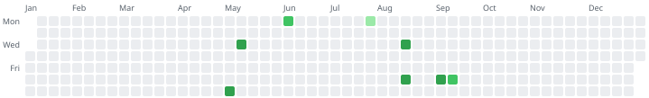

<!-- gamereg:begin block=summary -->
| Measure | Value |
|---|---|
| Hours | 13.0 |
| Sessions | 6 |
| Days played | 6 |
| Games played | 4 |
| Runs started | 4 |
| Runs finished | 1 |
| Runs abandoned | 1 |
| Longest session | 3h30 |
| Mean rating | 9.00 |
| First session | 2026-05-03 · Hollow Knight |
| Last session | 2026-08-15 · Tunic |
<!-- gamereg:end block=summary -->

## Calendar

<!-- gamereg:begin block=heatmap -->

<!-- gamereg:end block=heatmap -->

## Most played

<!-- gamereg:begin block=top -->
| Game | Hours | Sessions |
|---|---|---|
| [[games/hollow-knight\|Hollow Knight]] | 9.0 | 3 |
| [[games/tunic\|Tunic]] | 2.5 | 1 |
| [[games/outer-wilds\|Outer Wilds]] | 1.5 | 1 |
| [[games/celeste\|Celeste]] | 0.0 | 1 |
<!-- gamereg:end block=top -->

## Ratings

<!-- gamereg:begin block=ratings -->
| Rating | Runs |
|---|---|
| 9 | 1 |
<!-- gamereg:end block=ratings -->

## Finished

<!-- gamereg:begin block=finished -->
| Game | Ended | Hours | Rating |
|---|---|---|---|
| [[games/hollow-knight\|Hollow Knight]] | 2026-08-12 | 9.0 | 9 |
<!-- gamereg:end block=finished -->
